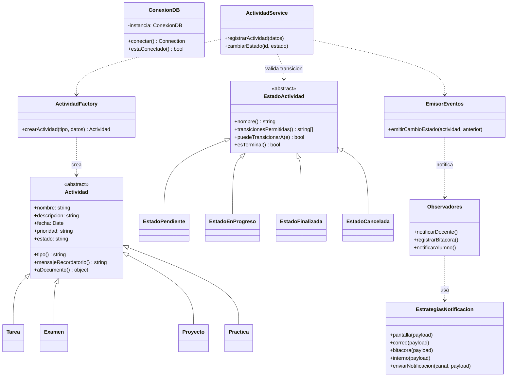
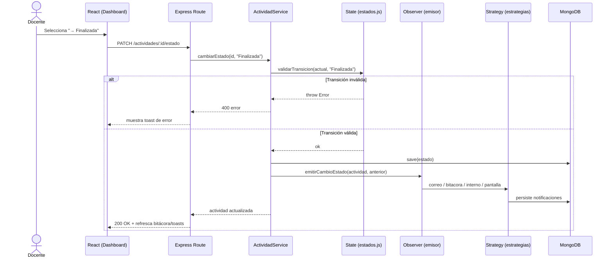
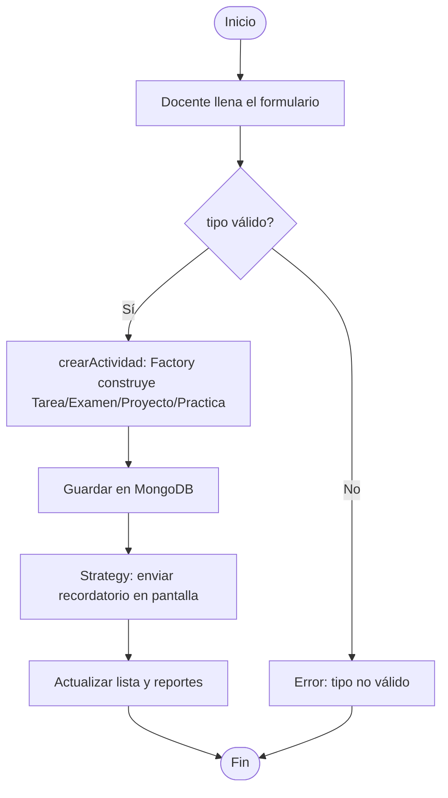
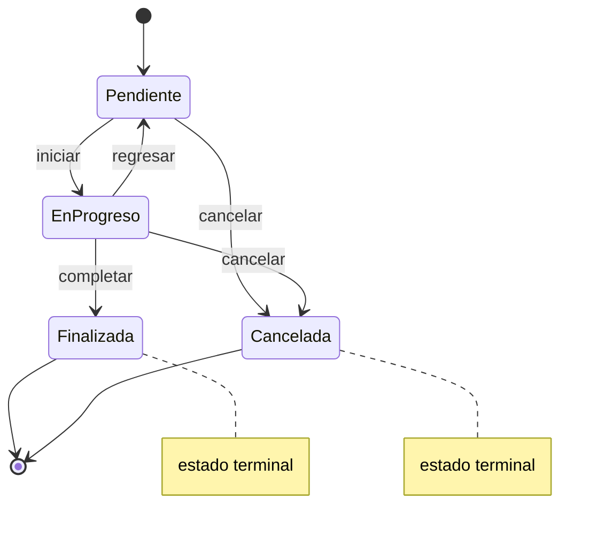
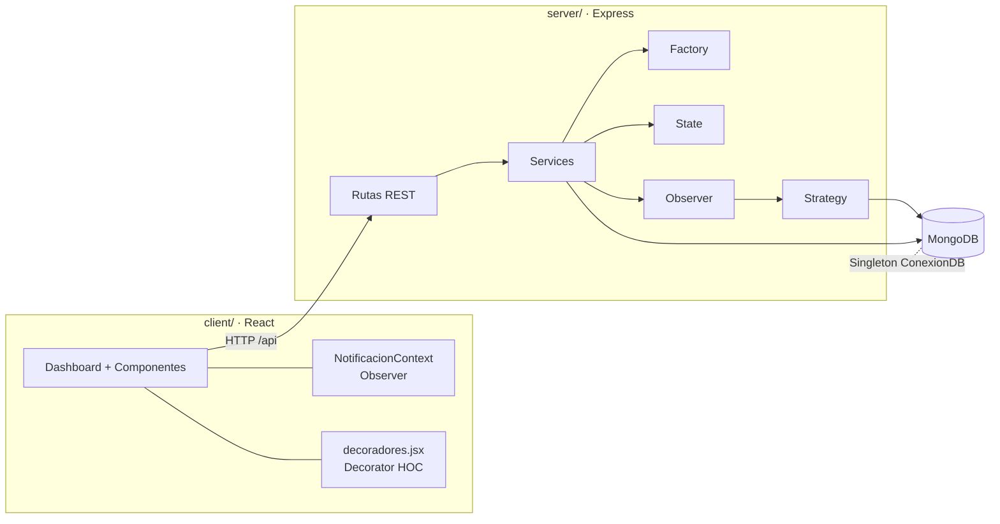

# 2. Diseño: diagramas UML y justificación de patrones

> Los diagramas usan sintaxis **Mermaid**; se renderizan en GitHub y en la
> mayoría de editores Markdown.

## 2.1 Diagrama de clases (dominio + patrones)

## 2.2 Diagrama de secuencia — Cambio de estado (State + Observer + Strategy)

## 2.3 Diagrama de flujo — Registrar actividad (Factory Method)

## 2.4 Diagrama de estados — Ciclo de vida de la actividad (patrón State)

## 2.5 Diagrama de componentes (arquitectura MERN)

## 2.6 Justificación de los patrones

| Patrón | Problema que resuelve | Beneficio |
|--------|----------------------|-----------|
| **Singleton** | Evitar múltiples conexiones a MongoDB | Una sola conexión reutilizable; menos consumo de recursos |
| **Factory Method** | Crear distintos tipos de actividad sin acoplar el código a las clases concretas | Agregar un tipo nuevo = registrar una clase; el resto no cambia |
| **State** | Reglas de transición de estado dispersas en `if/switch` | Cada estado encapsula sus transiciones; reglas claras y extensibles |
| **Observer** | Notificar a varios interesados al cambiar el estado | Desacopla el "qué cambió" del "quién se entera"; se agregan observadores sin tocar el emisor |
| **Strategy** | Elegir el mecanismo de envío en tiempo de ejecución | Canales intercambiables; nuevo canal = nueva estrategia |
| **Decorator** | Añadir realce visual por prioridad sin modificar la tarjeta | Composición de componentes; responsabilidad añadida dinámicamente |
